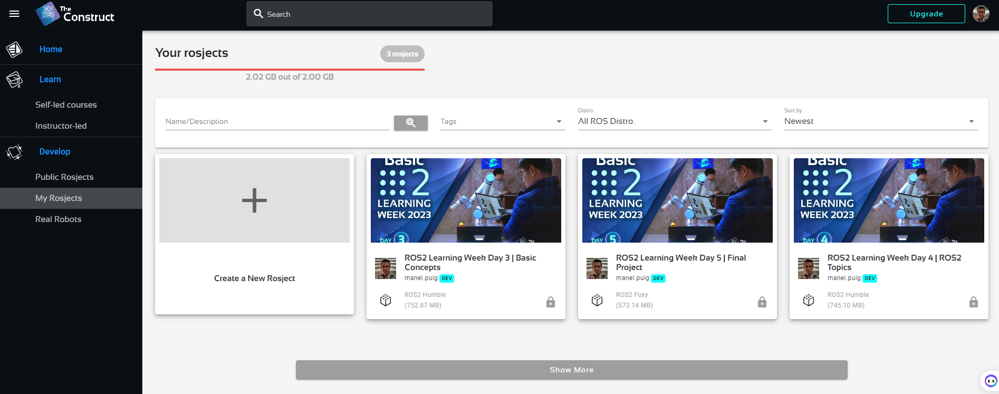
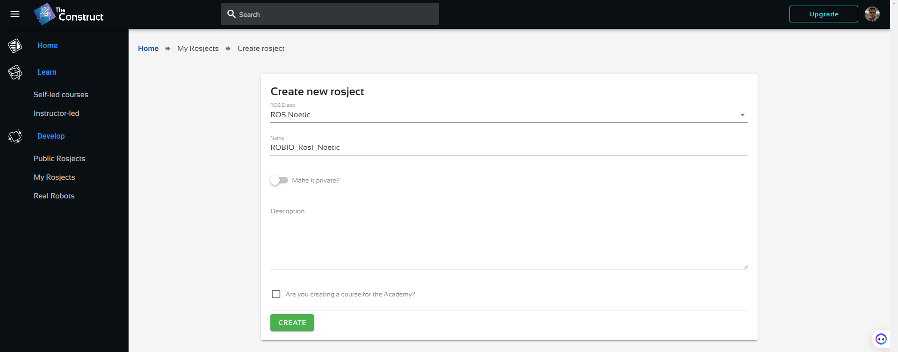

## **ROS2 gopigo3 setup**
The objective of this section is to setup the gopigo3 in HW and SW.

The objectives of this section are:
- Setup the ROS2 Humble environment
- Setup the Workspace repository to simulate gopigo3 in virtual environment
- Generate a proper SD card for HW project developments


## **1. Setup the ROS2 Humble environment**

First of all we will learn how to work within a ROS environment. You will have to choose between 3 possibilities:
- use a 3rd party open ROS environment (recommended)
- use a Docker utility
- use a Virtual machine with virtual box

## **1.1 Use open ROS environment**

You can use the ROS environment developed by "The Construct" (https://app.theconstructsim.com/), enterprise working on ROS academia and development and located in Barcelona.
- Open the link: https://app.theconstructsim.com/
- Create a free user account
- Select "myRosjects"

- Create a New Project

You will have 2GB Virtual machine with Ubuntu 20 and ROS Noetic installed for free!!

## **1.2 ROS Installation using Docker utility**
Installation instructions could be found in: https://docs.docker.com/desktop/

Some other interessant links could be found:
- http://wiki.ros.org/docker
- http://wiki.ros.org/docker/Tutorials/Docker

You have to install:

**a) Docker for windows:** an easy to install application that enables you to manage your containers (https://docs.docker.com/desktop/install/windows-install/)

* Then you have to complete your installation with WSL 2 for kernell update in: https://learn.microsoft.com/ca-es/windows/wsl/install-manual#step-4---download-the-linux-kernel-update-package
* Stablish WSL2 as default by opening a powershell and typing: wsl --set-default-version 2
* restart your computer

**b) X11 display server**: Xming X server for Windows (https://sourceforge.net/projects/xming/), and XQuartz for macOS (https://www.xquartz.org/index.html). That will allow you to visualize, in particular the RViZ robot visualization and tools and the Gazebo simulation of the robot.

**c)** **Visual Studio Code** (https://code.visualstudio.com/)

### **1.2.1 ROS Images**

The official images are mantained by Open Source Robotics Foundation (OSRF).

You can find them in:
- https://registry.hub.docker.com/_/ros/
- https://hub.docker.com/r/osrf/ros/tags

Open PowerShell and type:

```shell
docker pull osrf/ros:humble-desktop-full
```

To create a Container (choose proper name) with GUI and folder share (select your src absolute location), open a terminal and type:

```shell
docker run --name ROS2_Humble_osrf -e DISPLAY=host.docker.internal:0.0 --mount src="C:\Users\puigm\Desktop\ROS_github\myPC_shared",dst=/home/myDocker_shared,type=bind -it osrf/ros:humble-desktop-full
```

**Graphical interface**

For graphical interface, in **windows** open Xlaunch:

- First choose “Multiple windows” and set to 0 the "Display number”
- Then, set “Start no client” in the second screen
- In the third screen, click “Clipboard” and "Primary Selection", unclick "Native opengl" and click "Disable access control"
- And just click “Finalize” in the last screen

For graphical interface in **Mac os**:

To forward X11 GUI applications from a Docker container to a macOS host, you can follow these steps:
 - Install last version of XQuartz (https://www.xquartz.org/)
 - Go to "Preferences" > "Security" and make sure the "Allow connections from network clients" option is enabled.
 - enable X11 forwarding and provide the necessary environment variables:
 ```shell
 docker run -e DISPLAY=host.docker.internal:0 --net=host -it --rm ubuntu xeyes
```
Once the container is running, you can launch GUI applications from the container's command line, and they should appear on the macOS host's XQuartz server.

**VS Code as working tool**

We will use VS Code to sync a copy of your github repository.

- Install VS Code following instructions in document "InstallCode.doc"

- Run the docker container
- Open Visual Studio Code and Install the extensions:

    - Docker from Microsoft
    - Dev Containers from Microsoft
    - Git Extension Pack (when you are connected with container)

- Connect the container to VS Code:
    - from left-side menu choose Docker
    - right-click on the running container and select "Attach VS Code"
- Update your docker Container:
```shell
apt update
```

Install some functionalities you will need:

```shell
apt install -y git && apt install -y python3-pip
```
- Re-start the container


## **1.3 ROS Installation using Virtual machine with ROS**
You can always install a ROS virtual machine with Virtual Box for MAC
- Download Virtual Box for windows/macOS systems (https://www.virtualbox.org/wiki/Downloads)
- Install Virtual Box in your computer
- Download the ROS virtual machine in this link:
- and Add this ROS virtual machine choosing file-->Import appliance (and follow instructions)

You will have a ready to use ROS environment


# **2. Setup your Workspace**

Once you are in the ROS2 Humble environment, you can:

- create your own workspace
- Use an existing workspace

## **2.1 Create your own workspace**

This is the best option to learn ROS. You will create a new repository and you will follow the instructions to create all the packages to fulfill the objectives and functionalities.

- In your github account:
  - create a new public repository
  - add gitignore with ROS option

- In your docker container (within VS Code):
  - Clone your new created repository in /home folder
  - compile 

## **2.2 Use an existing workspace**

You can also use our repository and make your modifications according to the exercises we will propose you.
In that case, you can follow the instructions:

- Fork the "ROS2_gopigo_ws" repository from my github
  
- Open your ROS2 Humble environment
- Clone your forked directory in your home directory
  ```shell
  git clone https://github.com/yourusername/ROS2_gopigo_ws
  ```
- Open .bashrc file (from user) with VS Code (open file...)
- Ensure that you have the last 2 lines (review the exact name of your repository):

  ```xml
  source /opt/ros/humble/setup.bash
  source /home/ROS2_gopigo_ws/install/setup.bash
  source /usr/share/colcon_argcomplete/hook/colcon-argcomplete.bash
  ```
- open a new terminal and Compile:

  ```shell
  cd /home/ROS2_gopigo_ws
  catkin_make
  ```
> Some environments have /home/user/ instead of /home
- You are ready to work with your repository for this session

## **2.3. Repository syncronisation**

The objective is to update the changes you have made, when working in ROS environment, in your github repository.

**Using 3rd party open ROS environment**

You will have to download the repository and keep it in your local computer as a backup.

**Using Docker container** (within VS Code), you need to:

Syncronize the changes within VS Code: 
- Select "Source control" to see the changes you have made
- Select all changes and add a commit message
- When you will Push them, the first time you will be asked to link the repository to your github account:
- Open a terminal in VS Code and type the first time:
```shell
git config --global user.email mail@alumnes.ub.edu
git config --global user.name 'your github username'
```
- for succesive times, you only need to select changes, Commit a message and Push


**Using a virtual machine**, you need:
- Within VS Code: you need to do the same.

**Using github web editor**, you need:
- pressing "·" key (or add .dev extension)
- performing repository modifications
- typing "git pull" to syncronize


## **3. Generate a proper SD card for HW project developments**

Follow instructions to create download and save the ROS2 environment to a 32GB SD card: https://github.com/slowrunner/ROS2-GoPiGo3/blob/main/Docs/INSTALL_FROM_IMAGE.md

The SD card is configured:
- Login: ubuntu
- Pass: robots1234
- to connect RaspberryPi4 to Hotspot SSID Manel

Connect PC to the same Hotspot SSID Manel

Use ifconfig to optain the IP address assigned. The address for RaspberryPi4 is 192.168.54.144

You can connect to the RaspberryPi4 with ssh:
```shell
ssh ubuntu@192.168.54.144
```
