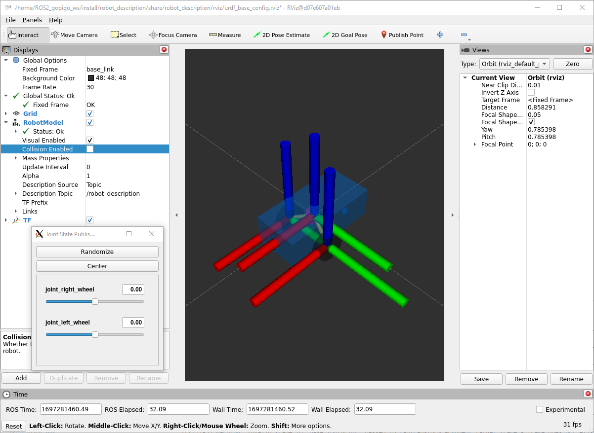
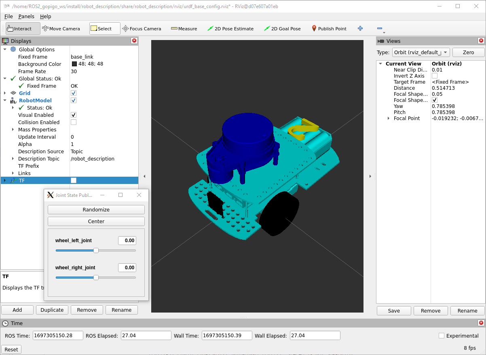

## **2. ROS2 gopigo3 model and Control**
The objective of this section is to simulate the gopigo3 behaviour in virtual environment.

The objectives of this section are:
- First connection to gopigo3
- Create a new "robot_description" package
- Create a complete robot model
- Spawn the robot model in a proper virtual world in gazebo environment

A very good guide is deescribed in: https://www.udemy.com/course/ros2-tf-urdf-rviz-gazebo/learn/lecture/38688920#overview

## **2.1. First connection to gopigo3**

The main information related to gopigo3 is in:
- https://github.com/slowrunner/rosbot-on-gopigo3/tree/main
- https://github.com/slowrunner/ROS2-GoPiGo3/tree/main

For the first test open the Document and follow instructions: https://github.com/slowrunner/ROS2-GoPiGo3/blob/main/Docs/Test_ROS2_GoPiGo3.md


### **2.2. Create a new "robot_description" package**
To create this package, type:
```shell
ros2 pkg create robot_description
```
Now proceed with the following instructions:
- remove "src" and "include" folders
- add "urdf", "launch" and "rviz" folders
- place the robot model in urdf folder
- Install the urdf, launch and rviz folders modifying the "CMakeList.txt" file:
```shell
cmake_minimum_required(VERSION 3.8)
project(robot_description)

if(CMAKE_COMPILER_IS_GNUCXX OR CMAKE_CXX_COMPILER_ID MATCHES "Clang")
  add_compile_options(-Wall -Wextra -Wpedantic)
endif()

# find dependencies
find_package(ament_cmake REQUIRED)

install(
  DIRECTORY urdf launch rviz
  DESTINATION share/${PROJECT_NAME}/
)

ament_package()
```
- move to the ws and compile again
- You can see the installed directories in "~/ROS2_gopigo_ws/install/robot_description/share/robot_description/" folders

Now everything is ready to create the **launch file**. This can be done in python but also in xml. We will do in xml language for simplicity and better understanding.
- verify "launch" folder is created and CMakeList.txt is created properly
- create a new file "display.launch.xml" inside
```xml
<launch>
    <let name="urdf_path" 
         value="$(find-pkg-share robot_description)/urdf/gpgMin.urdf" />
    <let name="rviz_config_path"
         value="$(find-pkg-share robot_description)/rviz/urdf_base_config.rviz" />

    <node pkg="robot_state_publisher" exec="robot_state_publisher">
        <param name="robot_description"
               value="$(command 'xacro $(var urdf_path)')" />
    </node>

    <node pkg="joint_state_publisher_gui" exec="joint_state_publisher_gui" />

    <node pkg="rviz2" exec="rviz2" output="screen" 
          args="-d $(var rviz_config_path)" />
</launch>
```

- compile again
- source install/setup.bash
- Launch:
```shell
ros2 launch robot_description display.launch.xml
```
- Configure the rviz with:
    - Fixed frame to "base_link"
    - add "RobotModel"
    - select the robot Description topic to /robot_description
    - add TFs
- save config to rviz folder as "urdf_base_config.rviz"

> Perhaps you will have to install:
>
>sudo apt install ros-humble-joint-state-publisher-gui



The same launch file can be done in python. You can see the syntax in "display.launch,py" file in "launch" folder.
- compile the ws
- open a new terminal and type
```shell
ros2 launch robot_description display.launch.py
```
>You will see the same as before

### **2.2. Create a robot model**

A first "gpgMin.urdf" file is delivered to display a first robot model in rviz program.

For a more complete robot model "gopigo3rp.urdf", we will add:
- Geometry within meshes folder
- gazebo plugins

Because we have added a folder "meshes" we have to install it in CMakeLists.txt in line:
```shell
...
install(
  DIRECTORY urdf launch rviz meshes
  DESTINATION share/${PROJECT_NAME}/
)
...
```

The robot model is specified by "gopigo3rp.urdf", in launch file:
```xml
...
<let name="urdf_path" 
     value="$(find-pkg-share robot_description)/urdf/gopigo3rp.urdf" />
...
```
- open a new terminal and type
```shell
colcon build
source install/setup.bash
ros2 launch robot_description display.launch.xml
```


>You will see the new robot model

### **2.3. Create a new robot_bringup package**

This is usually made to spawn the robot model in a proper virtual world in gazebo environment.

Let's follow similar steps as previous section for robot_description package:
- Create a new package:
```shell
ros2 pkg create robot_bringup
```
- remove "src" and "include" folders
- add "launch" "rviz" "worlds" folders
- Install the folders modifying the "CMakeList.txt" file:
```shell
cmake_minimum_required(VERSION 3.8)
project(robot_bringup)

if(CMAKE_COMPILER_IS_GNUCXX OR CMAKE_CXX_COMPILER_ID MATCHES "Clang")
  add_compile_options(-Wall -Wextra -Wpedantic)
endif()

# find dependencies
find_package(ament_cmake REQUIRED)

install(
  DIRECTORY launch rviz worlds
  DESTINATION share/${PROJECT_NAME}/
)

ament_package()
```
- create a new "my_robot_gazebo.launch.xml"
```xml
<launch>
    <let name="urdf_path" 
         value="$(find-pkg-share robot_description)/urdf/gopigo3rp.urdf" />
    <let name="rviz_config_path"
         value="$(find-pkg-share robot_bringup)/rviz/urdf_base_config.rviz" />

    <node pkg="robot_state_publisher" exec="robot_state_publisher">
        <param name="robot_description"
               value="$(command 'xacro $(var urdf_path)')" />
    </node>

    <include file="$(find-pkg-share gazebo_ros)/launch/gazebo.launch.py">
     <arg name="world" value="$(find-pkg-share robot_bringup)/worlds/test_world.world" />
    </include>

    <node pkg="gazebo_ros" exec="spawn_entity.py"
          args="-topic robot_description -entity my_robot" />

    <node pkg="rviz2" exec="rviz2" output="screen" 
          args="-d $(var rviz_config_path)" />
</launch>
```
- Because of we have used other packages, these have to be included in "package.xml" file:
```xml
...
  <exec_depend>robot_description</exec_depend>
  <exec_depend>robot_state_publisher</exec_depend>
  <exec_depend>gazebo_ros</exec_depend>
...
```
- Create also a "urdf_config.rviz" file in rviz folder
- Now you can compile again
```shell
colcon build
source install/setup.bash
```
You can now bringup your robot in the designed world
```shell
ros2 launch robot_bringup gopigo3rp_gazebo.launch.xml
```

**Activity:**

Bringup your rUBot model within the real custom designed World